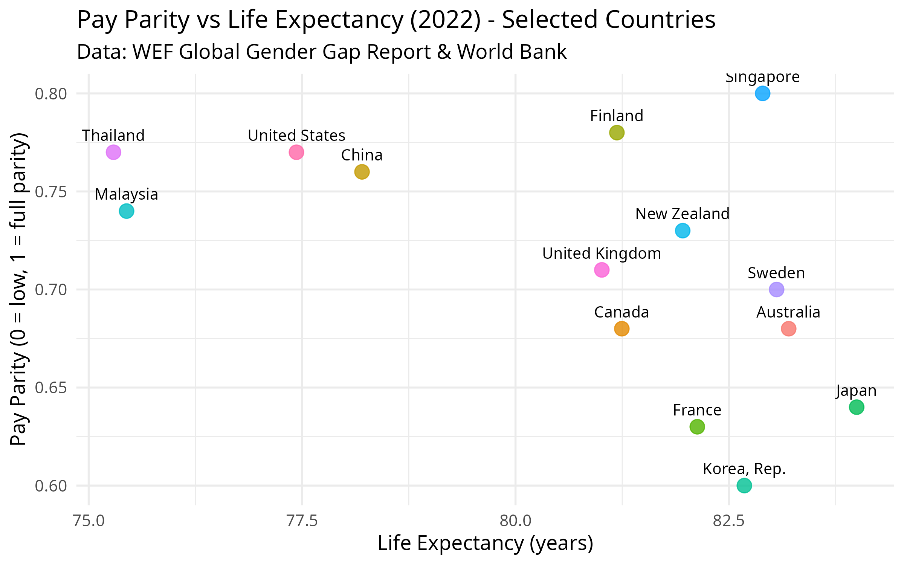

  
```{r setup,  echo=FALSE, results="hide", message=FALSE}
knitr::opts_chunk$set(echo = TRUE, warning = FALSE, message = FALSE)

library(readxl)
library(dplyr)
library(ggplot2)
library(countrycode)
library(WDI)

# Load WEF Gender Gap data (ensure WEF-GGR.xlsx is in working directory)
gender_gap_data <- read_excel("/home/psymeg/dev/r/pay-parity/WEF-GGR.xlsx", sheet = "Data")

# Filter for Wage equality indicator (2022)
payparity_data <- gender_gap_data %>%
  filter(Indicator == "Global Gender Gap Report: Wage equality between women and men for similar work") %>%
  select(country = `Economy Name`,
         iso3c = `Economy ISO3`,
         pay_parity = `2022`) %>%
  filter(!is.na(pay_parity))

# Fetch life expectancy data from World Bank (2022)
lifeexp_raw <- WDI(indicator = "SP.DYN.LE00.IN", start = 2022, end = 2022)

lifeexp_data <- lifeexp_raw %>%
  select(iso3c = iso2c,
         life_expectancy = SP.DYN.LE00.IN) %>%
  filter(!is.na(life_expectancy)) %>%
  mutate(iso3c = countrycode(iso3c, "iso2c", "iso3c"))

merged_data <- left_join(payparity_data, lifeexp_data, by = "iso3c") %>%
  filter(!is.na(life_expectancy))

# Optional: add region info
merged_data$region <- countrycode(merged_data$iso3c, "iso3c", "region")

# Define focus countries
focus_countries <- c("New Zealand", "Canada", "United States", "United Kingdom", "France",
                     "Japan", "China", "Australia", "Fiji", "Korea, Rep.")

payparity_focus <- merged_data %>%
  filter(country %in% focus_countries) %>%
  arrange(desc(pay_parity))  %>%
  filter(!is.na(pay_parity), !is.na(life_expectancy))

p1 <- ggplot(payparity_focus, aes(x = reorder(country, pay_parity), y = pay_parity)) +
  geom_col(fill = "#2c7fb8") +
  coord_flip() +
  theme_minimal(base_size = 12) +
  labs(title = "Pay Parity (Selected Countries, 2022)",
       x = "Country",
       y = "Pay Parity (0 = low, 1 = full parity)")

p1
```
```{r graph-p1,  echo=FALSE, results="hide", message=FALSE}

ggsave("pay_parity_bar_selected.png", plot = p1, width = 8, height = 5, dpi = 300)
knitr::include_graphics("pay_parity_bar_selected.png")
```

## Introduction

The World Economic Forum (WEF) is an international non-governmental organization based in Switzerland, best known for convening global leaders at its annual meeting in Davos to discuss pressing economic, social, and political issues. One of its flagship publications is the Global Gender Gap Report, which benchmarks gender-based disparities across countries in four key dimensions: economic participation and opportunity, educational attainment, health and survival, and political empowerment. The report draws on a wide range of internationally recognized data sources, including national statistics offices, the International Labour Organization (ILO), the World Health Organization (WHO), the United Nations Development Programme (UNDP), and proprietary WEF surveys such as the Executive Opinion Survey. These datasets are synthesized to produce standardized indices, allowing meaningful cross-country comparisons and tracking of gender parity trends over time.

With the recent decision in New Zealand to scrap attempts to promote pay parity, the  Global Gender Gap Report which has detailed indicators on economic participation, including wage equality for similar work, provides a useful source of data to analyse what sort of impact this change might have on the New Zealand economy going forward.

```{r graph-p2,  echo=FALSE, results="hide", message=FALSE}
merged_focus <- merged_data %>%
  filter(country %in% focus_countries) %>%
  filter(!is.na(pay_parity), !is.na(life_expectancy))

p2 <- ggplot(merged_focus, aes(x = pay_parity, y = life_expectancy)) +
  geom_point(aes(color = country), size = 4, alpha = 0.8) +
  geom_text(aes(label = country), hjust = 0.5, vjust = -1, size = 3.5) +
  theme_minimal(base_size = 12) +
  labs(title = "Pay Parity vs Life Expectancy (Selected Countries, 2022)",
       subtitle = "Data: WEF Global Gender Gap Report & World Bank",
       x = "Pay Parity (0 = low, 1 = full parity)",
       y = "Life Expectancy (years)",
       color = "Country") +
  theme(legend.position = "none")

p2
ggsave("pay_parity_vs_lifeexp_selected.png", plot = p2, width = 8, height = 5, dpi = 300)


```    
```{r graph-wageEquality,  echo=FALSE, results="hide", message=FALSE}
# Extract pay parity indicator cleanly — ONE row per country
payparity_data <- gender_gap_data %>%
  filter(Indicator == "Global Gender Gap Report: Wage equality between women and men for similar work") %>%
  select(country = `Economy Name`, iso3c = `Economy ISO3`, pay_parity = `2022`) %>%
  distinct(country, .keep_all = TRUE) %>%
  filter(!is.na(pay_parity))


## Labour Force Participation (2022)

labforce_data <- gender_gap_data %>%
  filter(Indicator == "Global Gender Gap Report: Labour force participation") %>%
  select(country = `Economy Name`, iso3c = `Economy ISO3`, labforce_participation = `2022`) %>%
  distinct(country, .keep_all = TRUE) %>%
  filter(!is.na(labforce_participation))
  
  labforce_focus <- labforce_data %>%
  filter(country %in% focus_countries) %>%
  filter(!is.na(labforce_participation))

p3 <- ggplot(labforce_focus, aes(x = reorder(country, labforce_participation), y = labforce_participation)) +
  geom_col(fill = "darkgreen") +
  coord_flip() +
  theme_minimal(base_size = 12) +
  labs(title = "Labour Force Participation (2022)",
       subtitle = "Selected Countries",
       x = "Country", y = "Labour Force Participation (Index 0-1)")

p3

# Save as PNG (optional)
ggsave("labforce_participation_bar.png", p3, width = 8, height = 5)

## Pay Parity vs Life Expectancy Scatter Plot
```
```{r, fig.width=8, fig.height=5}
p2 <- ggplot(merged_focus, aes(x = pay_parity, y = life_expectancy)) +
  geom_point(aes(color = country), size = 4, alpha = 0.8) +
  geom_text(aes(label = country), hjust = 0.5, vjust = -1, size = 3.5) +
  theme_minimal(base_size = 13) +
  labs(title = "Pay Parity vs Life Expectancy (2022)",
       subtitle = "Selected Countries",
       x = "Pay Parity (0 = low, 1 = full parity)",
       y = "Life Expectancy (years)") +
  theme(legend.position = "none")

p2

# Save as PNG
ggsave("pay_parity_vs_lifeexp.png", p2, width = 8, height = 5)
```


  