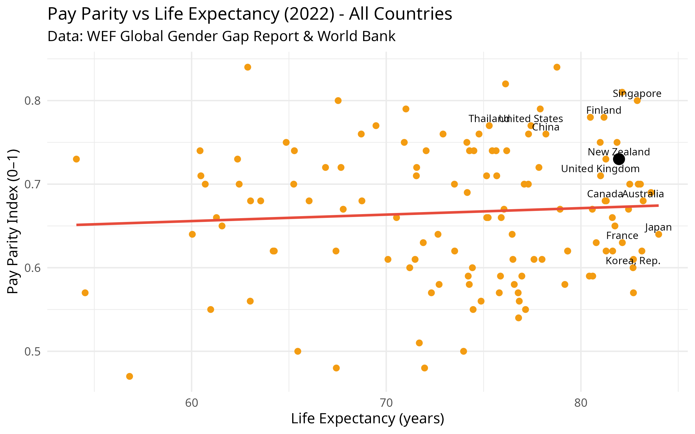

  

## Why Pay Parity Matters: Exploring the Broader Impact

Recent moves in New Zealand to roll back efforts aimed at achieving pay parity have sparked renewed debate over the true value of wage equality. These graphs take a look at where New Zealand stands in relation to other countries, looking to see if beyond the moral imperative of fairness, pay parity between men and women has any correlatation to economic performance, social wellbeing, and national resilience. 

The World Economic Forum’s Global Gender Gap Report is a rich dataset that provides detailed statistical data regarding wage equality, labor force participation, education, and health outcomes. Data from the excel data set released in 2022 is used. While the report for 2025 is available and can be accessed [here](https://www.weforum.org/publications/global-gender-gap-report-2025/).  By examining this data, we can start to understand how gender pay parity correlates with broader societal indicators such as life expectancy, crime, and economic opportunity. This raises important questions about the impact of this policy change on ordinary New Zealanders.

```{r setup,  echo=FALSE, results="hide", message=FALSE, warning=FALSE}
knitr::opts_chunk$set(echo = TRUE, warning = FALSE, message = FALSE)

library(readxl)
library(dplyr)
library(ggplot2)
library(countrycode)
library(WDI)
library(tidyverse)
library(scales)

# Load WEF Gender Gap data (ensure WEF-GGR.xlsx is in working directory)
gender_gap_data <- read_excel("/home/psymeg/dev/r/pay-parity/WEF-GGR.xlsx", sheet = "Data")

# Define focus countries
focus_countries <- c("New Zealand", "Canada", "United States", "United Kingdom", "France",
                     "Japan", "China", "Australia", "Korea, Rep.", "Singapore", "Thailand", "Finland")

# Filter for Wage equality indicator (2022)
payparity_data <- gender_gap_data %>%
  filter(Indicator == "Global Gender Gap Report: Wage equality between women and men for similar work", gender_gap_data$`Attribute 1` == "Index") %>%
  select(country = `Economy Name`,
         iso3c = `Economy ISO3`,
         pay_parity = `2022`) 

# Fetch life expectancy data from World Bank (2022)
lifeexp_raw <- WDI(indicator = "SP.DYN.LE00.IN", start = 2022, end = 2022)

lifeexp_data <- lifeexp_raw %>%
  select(iso3c = iso2c,
         life_expectancy = SP.DYN.LE00.IN) %>%
  filter(!is.na(life_expectancy)) %>%
  mutate(iso3c = countrycode(iso3c, "iso2c", "iso3c"))

merged_data <- payparity_data %>%
  left_join(lifeexp_data, by = "iso3c") %>%
  filter(!is.na(life_expectancy))

# Optional: add region info
merged_data$region <- countrycode(merged_data$iso3c, "iso3c", "region")

payparity_all <- merged_data %>%
  arrange(desc(pay_parity))  %>%
  filter(!is.na(pay_parity), !is.na(life_expectancy))

payparity_focus <- merged_data %>%
  filter(country %in% focus_countries) %>%
  arrange(desc(pay_parity))  %>%
  filter(!is.na(pay_parity), !is.na(life_expectancy))

p1 <- ggplot(payparity_focus, aes(x = reorder(country, pay_parity), 
                                  y = pay_parity, 
                                  fill = country == "New Zealand")) +
  geom_col() +
  scale_fill_manual(values = c("TRUE" = "#c0392b", "FALSE" = "#f39c12"), guide = "none") +
  coord_flip() +
  theme_minimal(base_size = 12) +
  labs(title = "Pay Parity (2022)",
       subtitle = "Selected Countries",
       x = "Country",
       y = "Pay Parity (0 = low, 1 = full parity)")

p1
```
```{r graph-p1,  echo=FALSE, results="hide", message=FALSE}

ggsave("pay_parity_bar_selected.png", plot = p1, width = 8, height = 5, dpi = 300)
knitr::include_graphics("pay_parity_bar_selected.png")

#get nz pay parity
nz_pay_parity <- payparity_all %>%
  filter(country == "New Zealand") %>%
  pull(pay_parity)

# Rank all countries by pay parity descending (1 = best)
payparity_ranked <- merged_data %>%
  filter(!is.na(pay_parity)) %>%
  distinct(country, .keep_all = TRUE) %>%     # Ensures 1 row per country
  arrange(desc(pay_parity)) %>%
  mutate(rank = row_number())

# Pull NZ's pay parity and rank cleanly
nz_row <- payparity_ranked %>%
  filter(country == "New Zealand")

nz_pay_parity <- nz_row$pay_parity
nz_rank <- nz_row$rank
total_countries <- nrow(payparity_ranked)
```

New Zealand's gender pay parity score in 2022 was `r round(nz_pay_parity, 2)`, ranking `r nz_rank` out of `r total_countries` countries globally according to the World Economic Forum.

As shown in the bar chart above, New Zealand ranks lower than I expected in wage equality for similar work compared to other developed economies. I would have expected a higher ranking given the country’s progressive reputation and historical efforts in gender equality such as being the first country in the world to give women the vote.

```{r labour-force-participation, echo=FALSE, results="hide", message=FALSE}

# Filter for 2022 Labour Force Participation Index
labforce_data <- gender_gap_data %>%
  filter(Indicator == "Global Gender Gap Report: Labour force participation",
         `Attribute 1` == "Index") %>%
  select(country = `Economy Name`,
         iso3c = `Economy ISO3`,
         labforce_participation = `2022`) %>%
  filter(!is.na(labforce_participation)) %>%
  mutate(labforce_participation = as.numeric(labforce_participation)) %>%
  distinct(country, .keep_all = TRUE)

# Subset to focus countries
labforce_focus <- labforce_data %>%
  filter(country %in% focus_countries)

# Plot bar chart with New Zealand highlighted
p3 <- ggplot(labforce_focus, aes(x = reorder(country, labforce_participation), 
                                 y = labforce_participation,  
                                 fill = country == "New Zealand")) +
  scale_fill_manual(values = c("TRUE" = "#c0392b", "FALSE" = "#f39c12"), guide = "none") +
  geom_col() +
  coord_flip() +
  theme_minimal(base_size = 12) +
  labs(title = "Labour Force Participation (2022)",
       subtitle = "Selected Countries",
       x = "Country", 
       y = "Labour Force Participation (Index 0–1)")

# Display plot
print(p3)

# Save image
ggsave("images/labforce_participation_bar.png", p3, width = 8, height = 5)

# Rank all countries by labour force participation
labourforce_ranked <- labforce_data %>%
  arrange(desc(labforce_participation)) %>%
  mutate(rank = row_number())

# Extract New Zealand's participation and rank
nz_row2 <- labourforce_ranked %>% filter(country == "New Zealand")
nz_labourforce2 <- nz_row2$labforce_participation
nz_rank2 <- nz_row2$rank
total_countries2 <- nrow(labourforce_ranked)

```

New Zealand's Labour Force Participation rate in 2022 was `r nz_row2$labforce_participation`, ranking `r nz_row2$rank` out of `r total_countries2` countries globally according to the World Economic Forum.

```{r graph-lifexpectancy,  echo=FALSE, results="hide", message=FALSE}
merged_focus <- merged_data %>%
  filter(country %in% focus_countries) %>%
  distinct(country, .keep_all = TRUE) %>%     # Ensures 1 row per country
  filter(!is.na(pay_parity), !is.na(life_expectancy))

nz_point <- merged_focus %>% filter(country == "New Zealand")
other_points <- merged_focus %>% filter(country != "New Zealand")

p2 <- ggplot(merged_focus, aes(x = life_expectancy, y = pay_parity)) +
  geom_point(data = other_points, aes(x = life_expectancy, y = pay_parity, color = country), size = 4, alpha = 0.8) +
  geom_point(data = nz_point, aes(x = life_expectancy, y = pay_parity), color = "black", size = 4) +
  geom_text(data = merged_focus, aes(x = life_expectancy, y = pay_parity, label = country), hjust = 0.5, vjust = -1, size = 3.5) +
  theme_minimal(base_size = 12) +
  labs(title = "Pay Parity vs Life Expectancy (2022) - Selected Countries",
       subtitle = "Data: WEF Global Gender Gap Report & World Bank",
       y = "Pay Parity (0 = low, 1 = full parity)",
       x = "Life Expectancy (years)") +
  theme(legend.position = "none")

p2
ggsave("images/pay_parity_vs_lifeexp_selected.png", plot = p2, width = 8, height = 5, dpi = 300)
knitr::include_graphics("images/pay_parity_vs_lifeexp_selected.png")


correlation_data <- payparity_data %>%
  inner_join(lifeexp_data, by = "iso3c") %>%
  filter(!is.na(pay_parity), !is.na(life_expectancy))
#Pearson correlation
correlation_value <- cor(correlation_data$pay_parity, correlation_data$life_expectancy)

model <- lm(life_expectancy ~ pay_parity, data = correlation_data)
summary(model)


```    

We can see that New Zealand ranks well in general compared with the selected countries. It is also worth considering if improving pay parity has an impact on life expectancy. 

A Pearson correlation between pay parity and life expectancy gives a value of `r round(correlation_value, 2)`. This is a very weak correlation. Other social, economic, legal and healthcare factors likely play a much larger role.

Below is a plot of all countries with data for 2022.

```{r graph-all-pp-le, echo=FALSE,results="hide", message=FALSE}
p3 <- ggplot(correlation_data, aes(y = pay_parity, x = life_expectancy, label = country)) +
  geom_point(color = "#f39c12", size = 2) +
  geom_point(data = nz_point, aes(x = life_expectancy, y = pay_parity), color = "black", size = 4) +
  geom_smooth(method = "lm", se = FALSE, color = "#e74c3c") +
  geom_text(data = subset(correlation_data, country %in% focus_countries),
            vjust = -0.5, size = 3) +
  theme_minimal(base_size = 12) +
  labs(title = "Pay Parity vs Life Expectancy (2022) - All Countries",
       subtitle = "Data: WEF Global Gender Gap Report & World Bank",
       y = "Pay Parity Index (0–1)",
       x = "Life Expectancy (years)")

p3
ggsave("images/pay_parity_vs_lifeexp_all.png", plot = p3, width = 8, height = 5, dpi = 300)


model <- lm(life_expectancy ~ pay_parity, data = correlation_data)
r_squared <- summary(model)$r.squared
p_value <- summary(model)$coefficients[2,4]
```

A linear regression suggests that countries with higher pay parity tend to have higher life expectancy. 
The model explains `r round(r_squared * 100, 1)`% of the variation in life expectancy, with a p-value of `r signif(p_value, 3)`.

The above Pearson correlation measures the strength and direction of a linear relationship between two variables whereas linear regression estimates the relationship by fitting a line to the data, allowing for predictions of one variable based on the other. In summary, correlation quantifies how closely two variables move together, whereas regression provides a predictive model.

In 2022, New Zealand had a pay parity index of 0.74 and a life expectancy of 82.5 years. The country with the lowest pay parity, Chad, had a pay parity index of 0.38 and a life expectancy of 52.5 years.

That’s a difference of 30 years in life expectancy; which is a striking contrast that underscores how broader social and economic inequalities may intersect with health outcomes.

This analysis suggests a moderate positive relationship between gender pay parity and life expectancy. While correlation doesn’t imply causation, countries with more equitable pay tend to report better health outcomes.

```{r graph-payparity-time,  echo=FALSE, results="hide", message=FALSE}
# Filter for correct indicator and attribute (Index)
payparity_timeseries <- gender_gap_data %>%
  filter(Indicator == "Global Gender Gap Report: Wage equality between women and men for similar work",
         `Attribute 1` == "Index",
         `Economy Name` %in% focus_countries) %>%
  select(country = `Economy Name`,
         iso3c = `Economy ISO3`,
         `2006`:`2022`) %>%
  pivot_longer(cols = `2006`:`2022`, names_to = "year", values_to = "pay_parity") %>%
  mutate(year = as.integer(year)) %>%
  filter(!is.na(pay_parity))

# Get country list
countries <- unique(payparity_timeseries$country)
other_countries <- setdiff(countries, "New Zealand")

# Set color mapping: black for NZ, distinct for others
other_colors <- setNames(hue_pal()(length(other_countries)), other_countries)
color_map <- c("New Zealand" = "black", other_colors)

# Plot
p_payparity_trend <- ggplot(payparity_timeseries, aes(x = year, y = pay_parity, color = country)) +
  geom_line(linewidth = 1.2) +
  geom_point(size = 1.5) +
  scale_color_manual(values = color_map) +
  theme_minimal(base_size = 13) +
  labs(title = "Wage Equality Index Over Time (Selected Countries)",
       subtitle = "Source: WEF Global Gender Gap Report",
       x = "Year",
       y = "Pay Parity (0 = low, 1 = full parity)",
       colour = "Country")

# Save and show
ggsave("images/p_payparity_trend.png", plot = p_payparity_trend, width = 8, height = 5, dpi = 300)
knitr::include_graphics("images/p_payparity_trend.png")
print(p_payparity_trend)

```
Looking at trends over time, we can see countries taking different paths. While some countries have steadily moved towards pay parity, others have plateaued or even regressed. This visual reinforces the idea that policy decisions are important. Countries that commit to closing the wage gap often see tangible progress, with those that stall falling behind their peers.

```{r graph-female-labour-force,  echo=FALSE, results="hide", message=FALSE}
# Extract female labour force participation index (normalized 0–1)
labour_participation_data <- gender_gap_data %>%

  filter(Indicator == "Global Gender Gap Report: Labour force participation",
         `Attribute 1` == "Index") %>%
  select(country = `Economy Name`,
         iso3c = `Economy ISO3`,
         labor_participation = `2022`) %>%
  filter(country %in% focus_countries) %>%
  filter(!is.na(labor_participation))

labour_vs_parity <- payparity_data %>%
  inner_join(labour_participation_data, by = c("country", "iso3c"))

# Split data into NZ and others
nz_point <- labour_vs_parity %>% filter(country == "New Zealand")
other_points <- labour_vs_parity %>% filter(country != "New Zealand")

# Plot
p_labour <- ggplot() +
  geom_point(data = other_points, aes(x = labor_participation, y = pay_parity, color = country), size = 3, alpha = 0.8) +
  geom_text(data = other_points, aes(x = labor_participation, y = pay_parity, label = country), 
            hjust = 0.5, vjust = -1, size = 3.5) +
  geom_point(data = nz_point, aes(x = labor_participation, y = pay_parity), color = "black", size = 3, alpha = 0.8) +
  geom_text(data = nz_point, aes(x = labor_participation, y = pay_parity, label = country), 
            hjust = 0.5, vjust = -1, size = 3.5, color = "black") +
#  geom_smooth(data = labour_vs_parity, aes(x = labor_participation, y = pay_parity), 
 #             method = "lm", se = FALSE, color = "#1b9e77") +
  labs(title = "Female Labor Force Participation vs Pay Parity (2022)",
       x = "Labour Force Participation Index (0 = low, 1 = parity)",
       y = "Pay Parity Index (0 = low, 1 = parity)",
       subtitle = "Source: WEF Global Gender Gap Report") +
  theme_minimal(base_size = 12) +
  theme(legend.position = "none")

ggsave("images/pay_parity_vs_labour_selected.png", plot = p_labour, width = 8, height = 5, dpi = 300)
knitr::include_graphics("images/pay_parity_vs_labour_selected.png")

#print(p_labour)

```  

```{r homicide-data,  echo=FALSE, results="hide", message=FALSE}

# Retrieve homicide rates
homicide_data_raw <- WDI(country = "all", indicator = "VC.IHR.PSRC.P5", start = 2019, end = 2019, extra = TRUE)

# Clean and filter homicide data
homicide_data <- homicide_data_raw %>%
  filter(!is.na(VC.IHR.PSRC.P5), region != "Aggregates") %>%
  select(country = country, iso3c = iso3c, homicide_rate = VC.IHR.PSRC.P5) %>%
  filter(country %in% focus_countries)

# Merge with pay parity data
homicide_vs_parity <- payparity_data %>%
  inner_join(homicide_data, by = c("country", "iso3c"))

homicide_vs_parity <- homicide_vs_parity %>%
  filter(!is.na(homicide_rate), homicide_rate > 0)

# Split data into NZ and others
nz_point <- homicide_vs_parity %>% filter(country == "New Zealand")
other_points <- homicide_vs_parity %>% filter(country != "New Zealand")

# Plot
p_homicide_log <- ggplot() +
  geom_point(data = other_points, aes(x = homicide_rate, y = pay_parity, color = country), size = 3, alpha = 0.8) +
  geom_text(data = other_points, aes(x = homicide_rate, y = pay_parity, label = country), 
            hjust = 0.5, vjust = -1, size = 3.5) +
  geom_point(data = nz_point, aes(x = homicide_rate, y = pay_parity), color = "black", size = 3, alpha = 0.8) +
  geom_text(data = nz_point, aes(x = homicide_rate, y = pay_parity, label = country), 
            hjust = 0.5, vjust = -1, size = 3.5, color = "black") +
#  geom_smooth(data = homicide_vs_parity, aes(x = homicide_rate, y = pay_parity), 
   #           method = "lm", se = FALSE, color = "#1b9e77") +
  scale_x_log10() +
  labs(title = "Homicide Rate vs Pay Parity (2019)",
       x = "Homicide Rate (log scale, per 100,000 people)",
       y = "Pay Parity Index (0 = low, 1 = parity)",
       subtitle = "Sources: WEF Global Gender Gap Report & World Bank (WDI)") +
  theme_minimal(base_size = 12) +
  theme(legend.position = "none")

ggsave("images/pay_parity_vs_homicide_log_selected.png", plot = p_homicide_log, width = 8, height = 5, dpi = 300)
knitr::include_graphics("images/pay_parity_vs_homicide_log_selected.png")

print(p_homicide_log)

homicide_vs_parity <- payparity_data %>%
  inner_join(homicide_data, by = c("country", "iso3c"))

#Pearson correlation
cor_homicide <- cor(homicide_vs_parity$pay_parity, homicide_vs_parity$homicide_rate, use = "complete.obs")


``` 

The Pearson correlation between pay parity and homicide rate is -0.4. This indicates a moderate negative relationship which means that, as gender pay parity improves, homicide rates tend to decline. While this is not a perfect or causal relationship, it's statistically meaningful and socially relevant.


```{r U5-mortality-Rate,  echo=FALSE, results="hide", message=FALSE}

# Retrieve homicide rates
mortality_data_raw <- WDI(country = "all", indicator = "SH.DYN.MORT", start = 2020, end = 2020, extra = TRUE)

# Clean and filter mortality data
mortality_rate_data <- mortality_data_raw %>%
  filter(!is.na(SH.DYN.MORT), region != "Aggregates") %>%
  select(country, iso3c, mortality_rate = SH.DYN.MORT) %>%
  filter(country %in% focus_countries)

# Merge with pay parity data
mortality_vs_parity <- payparity_data %>%
  inner_join(mortality_rate_data, by = c("country", "iso3c")) %>%
  filter(!is.na(mortality_rate), mortality_rate > 0)

# Split data into NZ and others
nz_point <- mortality_vs_parity %>% filter(country == "New Zealand")
other_points <- mortality_vs_parity %>% filter(country != "New Zealand")

# Plot
p_mortality <- ggplot() +
  geom_point(data = other_points, aes(x = mortality_rate, y = pay_parity, color = country), size = 3, alpha = 0.8) +
  geom_text(data = other_points, aes(x = mortality_rate, y = pay_parity, label = country), 
            hjust = 0.5, vjust = -1, size = 3.5) +
  geom_point(data = nz_point, aes(x = mortality_rate, y = pay_parity), color = "black", size = 3, alpha = 0.8) +
  geom_text(data = nz_point, aes(x = mortality_rate, y = pay_parity, label = country), 
            hjust = 0.5, vjust = -1, size = 3.5, color = "black") +
  scale_x_log10() +  # Log scale for mortality rate
  labs(title = "Under-5 Mortality Rate vs Pay Parity (2020) - Selected Countries",
       x = "Under-5 Mortality Rate (log scale, per 1,000 live births)",
       y = "Pay Parity Index (0 = low, 1 = parity)",
       subtitle = "Sources: WEF Global Gender Gap Report & World Bank (WDI)") +
  theme_minimal(base_size = 12) +
  theme(legend.position = "none")

# Save and display
ggsave("images/pay_parity_vs_mortality_selected.png", plot = p_mortality, width = 8, height = 5, dpi = 300)
knitr::include_graphics("images/pay_parity_vs_mortality_selected.png")

print(p_mortality)

cor_mortality <- cor(mortality_vs_parity$pay_parity, mortality_vs_parity$mortality_rate, use = "complete.obs")


``` 

The Pearson correlation between pay parity and Under 5 mortality rate is -0.04. This suggests that, at the global level, gender pay parity alone is not a strong predictor of child survival outcomes. It’s likely that a complex mix of factors; including income levels, public health systems, education, and social policy all have a stronger impact on child mortality.
 

## Final Thoughts

The data raises a number of thought-provoking questions. While New Zealand performs relatively well on pay parity, it lags behind in key areas such as under-5 mortality and homicide rates. What relationship, if any, exists between gender equity and broader social outcomes? Could a stronger focus on pay parity contribute to improvements in public health and safety, or are these patterns driven by deeper, more complex forces?

As New Zealand considers its future priorities, this analysis invites a wider conversation about the links between equity, wellbeing, and societal resilience. Overall I would give us a B+ - still room to improve in many areas.