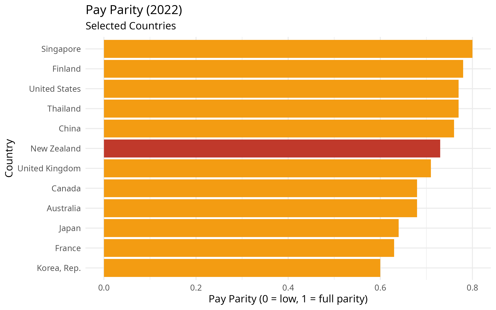
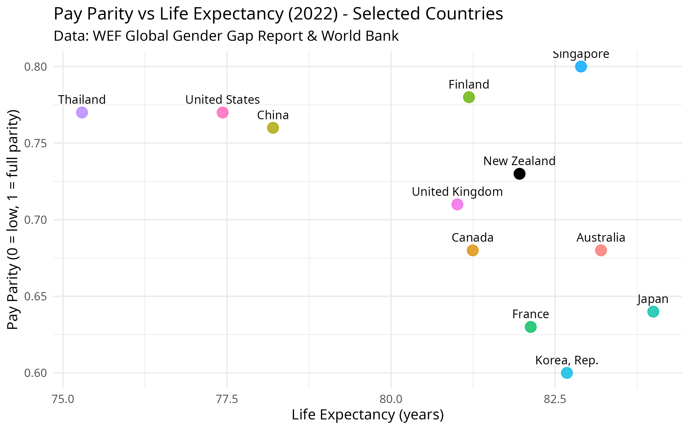
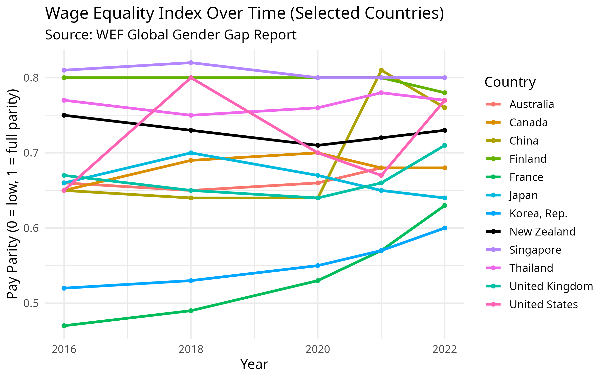
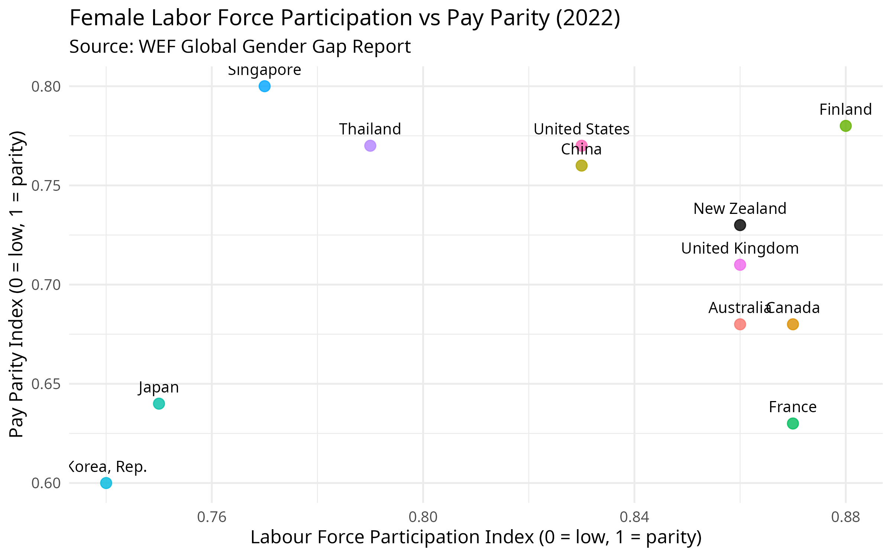

  

## Why Pay Parity Matters: Exploring the Broader Impact

Recent politically motivated moves in New Zealand to roll back efforts aimed at achieving pay parity have sparked renewed debate over the true value of wage equality. I thought it would be interesting to take a look at where New Zealand stands currently in relation to other countries. Also I wanted to see if beyond the moral imperative of fairness, pay parity between men and women has and correlatation to economic performance, social wellbeing, and national resilience. After a quick search I found The World Economic Forum’s Global Gender Gap Report which has a rich dataset that provides detailed statistical data regarding wage equality, labor force participation, education, and health outcomes. By examining this data, we can start to understand how gender pay parity correlates with broader societal indicators such as life expectancy, crime, and economic opportunity. This raises important questions about what Kiwis stands to gain or lose by stepping back from parity.


```{r setup,  echo=FALSE, results="hide", message=FALSE, warning=FALSE}
knitr::opts_chunk$set(echo = TRUE, warning = FALSE, message = FALSE)

library(readxl)
library(dplyr)
library(ggplot2)
library(countrycode)
library(WDI)
library(tidyverse)
library(RColorBrewer)
library(scales)

# Load WEF Gender Gap data (ensure WEF-GGR.xlsx is in working directory)
gender_gap_data <- read_excel("/home/psymeg/dev/r/pay-parity/WEF-GGR.xlsx", sheet = "Data")

# Define focus countries
focus_countries <- c("New Zealand", "Canada", "United States", "United Kingdom", "France",
                     "Japan", "China", "Australia", "Korea, Rep.", "Singapore", "Thailand", "Finland")

# Filter for Wage equality indicator (2022)
payparity_data <- gender_gap_data %>%
  filter(Indicator == "Global Gender Gap Report: Wage equality between women and men for similar work", gender_gap_data$`Attribute 1` == "Index") %>%
  select(country = `Economy Name`,
         iso3c = `Economy ISO3`,
         pay_parity = `2022`) 

# Fetch life expectancy data from World Bank (2022)
lifeexp_raw <- WDI(indicator = "SP.DYN.LE00.IN", start = 2022, end = 2022)

lifeexp_data <- lifeexp_raw %>%
  select(iso3c = iso2c,
         life_expectancy = SP.DYN.LE00.IN) %>%
  filter(!is.na(life_expectancy)) %>%
  mutate(iso3c = countrycode(iso3c, "iso2c", "iso3c"))

merged_data <- payparity_data %>%
  left_join(lifeexp_data, by = "iso3c") %>%
  filter(!is.na(life_expectancy))

# Optional: add region info
merged_data$region <- countrycode(merged_data$iso3c, "iso3c", "region")

payparity_all <- merged_data %>%
  arrange(desc(pay_parity))  %>%
  filter(!is.na(pay_parity), !is.na(life_expectancy))

payparity_focus <- merged_data %>%
  filter(country %in% focus_countries) %>%
  arrange(desc(pay_parity))  %>%
  filter(!is.na(pay_parity), !is.na(life_expectancy))

p1 <- ggplot(payparity_focus, aes(x = reorder(country, pay_parity), 
                                  y = pay_parity, 
                                  fill = country == "New Zealand")) +
  geom_col() +
  scale_fill_manual(values = c("TRUE" = "#c0392b", "FALSE" = "#f39c12"), guide = "none") +
  coord_flip() +
  theme_minimal(base_size = 12) +
  labs(title = "Pay Parity (2022)",
       subtitle = "Selected Countries",
       x = "Country",
       y = "Pay Parity (0 = low, 1 = full parity)")

p1
```
```{r graph-p1,  echo=FALSE, results="hide", message=FALSE}

ggsave("pay_parity_bar_selected.png", plot = p1, width = 8, height = 5, dpi = 300)


#get nz pay parity
nz_pay_parity <- payparity_all %>%
  filter(country == "New Zealand") %>%
  pull(pay_parity)

# Rank all countries by pay parity descending (1 = best)
payparity_ranked <- merged_data %>%
  filter(!is.na(pay_parity)) %>%
  distinct(country, .keep_all = TRUE) %>%     # Ensures 1 row per country
  arrange(desc(pay_parity)) %>%
  mutate(rank = row_number())

# Pull NZ's pay parity and rank cleanly
nz_row <- payparity_ranked %>%
  filter(country == "New Zealand")

nz_pay_parity <- nz_row$pay_parity
nz_rank <- nz_row$rank
total_countries <- nrow(payparity_ranked)
```

As shown in the bar chart above, New Zealand ranks relatively lowly in wage equality for similar work compared to other developed economies. This is especially striking given the country’s progressive reputation and historical efforts in gender equality such as being the first country in the world to give women the vote. The data suggests that other nations, for example, Korea, France, and Japan, are making greater progress in regards to pay parity despite facing their own systemic challenges. 

New Zealand's gender pay parity score in 2022 was `r round(nz_pay_parity, 2)`, ranking `r nz_rank` out of `r total_countries` countries globally according to the World Economic Forum.

```{r labour-force-participation,  echo=FALSE, results="hide", message=FALSE}

labforce_data <- gender_gap_data %>%
  filter(Indicator == "Global Gender Gap Report: Labour force participation") %>%
  select(country = `Economy Name`, iso3c = `Economy ISO3`, labforce_participation = `2022`) %>%
  distinct(country, .keep_all = TRUE) %>%
  filter(!is.na(labforce_participation))
  
  labforce_focus <- labforce_data %>%
  filter(country %in% focus_countries) %>%
  filter(!is.na(labforce_participation))

p3 <- ggplot(labforce_focus, aes(x = reorder(country, labforce_participation), y = labforce_participation,  fill = country == "New Zealand")) +
  scale_fill_manual(values = c("TRUE" = "#c0392b", "FALSE" = "#f39c12"), guide = "none") +
  geom_col() +
  coord_flip() +
  theme_minimal(base_size = 12) +
  labs(title = "Labour Force Participation (2022)",
       subtitle = "Selected Countries",
       x = "Country", y = "Labour Force Participation (Index 0-1)")

p3

# Save as PNG (optional)
ggsave("images/labforce_participation_bar.png", p3, width = 8, height = 5)

```

```{r graph-p2,  echo=FALSE, results="hide", message=FALSE}
merged_focus <- merged_data %>%
  filter(country %in% focus_countries) %>%
  distinct(country, .keep_all = TRUE) %>%     # Ensures 1 row per country
  filter(!is.na(pay_parity), !is.na(life_expectancy))

nz_point <- merged_focus %>% filter(country == "New Zealand")
other_points <- merged_focus %>% filter(country != "New Zealand")

p2 <- ggplot(merged_focus, aes(x = life_expectancy, y = pay_parity)) +
  geom_point(data = other_points, aes(x = life_expectancy, y = pay_parity, color = country), size = 4, alpha = 0.8) +
  geom_point(data = nz_point, aes(x = life_expectancy, y = pay_parity), color = "black", size = 4) +
  geom_text(data = merged_focus, aes(x = life_expectancy, y = pay_parity, label = country), hjust = 0.5, vjust = -1, size = 3.5) +
  theme_minimal(base_size = 12) +
  labs(title = "Pay Parity vs Life Expectancy (2022) - Selected Countries",
       subtitle = "Data: WEF Global Gender Gap Report & World Bank",
       y = "Pay Parity (0 = low, 1 = full parity)",
       x = "Life Expectancy (years)") +
  theme(legend.position = "none")

p2
ggsave("images/pay_parity_vs_lifeexp_selected.png", plot = p2, width = 8, height = 5, dpi = 300)


```    

We can see New Zealand is middling, off the pace in terms of both Pay Parity and Life Expectancy with Singapore clearly the winner. 

```{r graph-payparity-time,  echo=FALSE, results="hide", message=FALSE}
# Filter for correct indicator and attribute (Index)
payparity_timeseries <- gender_gap_data %>%
  filter(Indicator == "Global Gender Gap Report: Wage equality between women and men for similar work",
         `Attribute 1` == "Index",
         `Economy Name` %in% focus_countries) %>%
  select(country = `Economy Name`,
         iso3c = `Economy ISO3`,
         `2006`:`2022`) %>%
  pivot_longer(cols = `2006`:`2022`, names_to = "year", values_to = "pay_parity") %>%
  mutate(year = as.integer(year)) %>%
  filter(!is.na(pay_parity))

# Get country list
countries <- unique(payparity_timeseries$country)
other_countries <- setdiff(countries, "New Zealand")

# Set color mapping: black for NZ, distinct for others
other_colors <- setNames(hue_pal()(length(other_countries)), other_countries)
color_map <- c("New Zealand" = "black", other_colors)

# Plot
p_payparity_trend <- ggplot(payparity_timeseries, aes(x = year, y = pay_parity, color = country)) +
  geom_line(linewidth = 1.2) +
  geom_point(size = 1.5) +
  scale_color_manual(values = color_map) +
  theme_minimal(base_size = 13) +
  labs(title = "Wage Equality Index Over Time (Selected Countries)",
       subtitle = "Source: WEF Global Gender Gap Report",
       x = "Year",
       y = "Pay Parity (0 = low, 1 = full parity)",
       colour = "Country")

# Save and show
ggsave("images/p_payparity_trend.png", plot = p_payparity_trend, width = 8, height = 5, dpi = 300)

print(p_payparity_trend)

```
Looking at trends over time, we can see countries taking different paths. While some countries have steadily improved, others like New Zealand appear to have plateaued or even regressed. This visual reinforces the idea that policy decisions are important. Countries that commit to closing the wage gap often see tangible progress, with those that stall falling behind their peers.

```{r graph-female-labour-force,  echo=FALSE, results="hide", message=FALSE}
# Extract female labour force participation index (normalized 0–1)
labour_participation_data <- gender_gap_data %>%

  filter(Indicator == "Global Gender Gap Report: Labour force participation",
         `Attribute 1` == "Index") %>%
  select(country = `Economy Name`,
         iso3c = `Economy ISO3`,
         labor_participation = `2022`) %>%
  filter(country %in% focus_countries) %>%
  filter(!is.na(labor_participation))

labour_vs_parity <- payparity_data %>%
  inner_join(labour_participation_data, by = c("country", "iso3c"))

# Split data into NZ and others
nz_point <- labour_vs_parity %>% filter(country == "New Zealand")
other_points <- labour_vs_parity %>% filter(country != "New Zealand")

# Plot
p_labour <- ggplot() +
  geom_point(data = other_points, aes(x = labor_participation, y = pay_parity, color = country), size = 3, alpha = 0.8) +
  geom_text(data = other_points, aes(x = labor_participation, y = pay_parity, label = country), 
            hjust = 0.5, vjust = -1, size = 3.5) +
  geom_point(data = nz_point, aes(x = labor_participation, y = pay_parity), color = "black", size = 3, alpha = 0.8) +
  geom_text(data = nz_point, aes(x = labor_participation, y = pay_parity, label = country), 
            hjust = 0.5, vjust = -1, size = 3.5, color = "black") +
#  geom_smooth(data = labour_vs_parity, aes(x = labor_participation, y = pay_parity), 
 #             method = "lm", se = FALSE, color = "#1b9e77") +
  labs(title = "Female Labor Force Participation vs Pay Parity (2022)",
       x = "Labour Force Participation Index (0 = low, 1 = parity)",
       y = "Pay Parity Index (0 = low, 1 = parity)",
       subtitle = "Source: WEF Global Gender Gap Report") +
  theme_minimal(base_size = 12) +
  theme(legend.position = "none")

ggsave("images/pay_parity_vs_labour_selected.png", plot = p_labour, width = 8, height = 5, dpi = 300)


print(p_labour)

```  

```{r homicide-data,  echo=FALSE, results="hide", message=FALSE}

# Retrieve homicide rates
homicide_data_raw <- WDI(country = "all", indicator = "VC.IHR.PSRC.P5", start = 2019, end = 2019, extra = TRUE)

# Clean and filter homicide data
homicide_data <- homicide_data_raw %>%
  filter(!is.na(VC.IHR.PSRC.P5), region != "Aggregates") %>%
  select(country = country, iso3c = iso3c, homicide_rate = VC.IHR.PSRC.P5) %>%
  filter(country %in% focus_countries)

# Merge with pay parity data
homicide_vs_parity <- payparity_data %>%
  inner_join(homicide_data, by = c("country", "iso3c"))

homicide_vs_parity <- homicide_vs_parity %>%
  filter(!is.na(homicide_rate), homicide_rate > 0)

# Split data into NZ and others
nz_point <- homicide_vs_parity %>% filter(country == "New Zealand")
other_points <- homicide_vs_parity %>% filter(country != "New Zealand")

# Plot
p_homicide_log <- ggplot() +
  geom_point(data = other_points, aes(x = homicide_rate, y = pay_parity, color = country), size = 3, alpha = 0.8) +
  geom_text(data = other_points, aes(x = homicide_rate, y = pay_parity, label = country), 
            hjust = 0.5, vjust = -1, size = 3.5) +
  geom_point(data = nz_point, aes(x = homicide_rate, y = pay_parity), color = "black", size = 3, alpha = 0.8) +
  geom_text(data = nz_point, aes(x = homicide_rate, y = pay_parity, label = country), 
            hjust = 0.5, vjust = -1, size = 3.5, color = "black") +
#  geom_smooth(data = homicide_vs_parity, aes(x = homicide_rate, y = pay_parity), 
   #           method = "lm", se = FALSE, color = "#1b9e77") +
  scale_x_log10() +
  labs(title = "Homicide Rate vs Pay Parity (2019)",
       x = "Homicide Rate (log scale, per 100,000 people)",
       y = "Pay Parity Index (0 = low, 1 = parity)",
       subtitle = "Sources: WEF Global Gender Gap Report & World Bank (WDI)") +
  theme_minimal(base_size = 12) +
  theme(legend.position = "none")

ggsave("images/pay_parity_vs_homicide_log_selected.png", plot = p_homicide_log, width = 8, height = 5, dpi = 300)
knitr::include_graphics("images/pay_parity_vs_homicide_log_selected.png")

print(p_homicide_log)

``` 

```{r U5-mortality-Rate,  echo=FALSE, results="hide", message=FALSE}

# Retrieve homicide rates
mortality_data_raw <- WDI(country = "all", indicator = "SH.DYN.MORT", start = 2020, end = 2020, extra = TRUE)

# Clean and filter mortality data
mortality_rate_data <- mortality_data_raw %>%
  filter(!is.na(SH.DYN.MORT), region != "Aggregates") %>%
  select(country, iso3c, mortality_rate = SH.DYN.MORT) %>%
  filter(country %in% focus_countries)

# Merge with pay parity data
mortality_vs_parity <- payparity_data %>%
  inner_join(mortality_rate_data, by = c("country", "iso3c")) %>%
  filter(!is.na(mortality_rate), mortality_rate > 0)

# Split data into NZ and others
nz_point <- mortality_vs_parity %>% filter(country == "New Zealand")
other_points <- mortality_vs_parity %>% filter(country != "New Zealand")

# Plot
p_mortality <- ggplot() +
  geom_point(data = other_points, aes(x = mortality_rate, y = pay_parity, color = country), size = 3, alpha = 0.8) +
  geom_text(data = other_points, aes(x = mortality_rate, y = pay_parity, label = country), 
            hjust = 0.5, vjust = -1, size = 3.5) +
  geom_point(data = nz_point, aes(x = mortality_rate, y = pay_parity), color = "black", size = 3, alpha = 0.8) +
  geom_text(data = nz_point, aes(x = mortality_rate, y = pay_parity, label = country), 
            hjust = 0.5, vjust = -1, size = 3.5, color = "black") +
  geom_smooth(data = mortality_vs_parity, aes(x = mortality_rate, y = pay_parity), 
              method = "lm", se = FALSE, color = "#1b9e77") +
  scale_x_log10() +  # Log scale for mortality rate
  labs(title = "Under-5 Mortality Rate vs Pay Parity (2020) - Selected Countries",
       x = "Under-5 Mortality Rate (log scale, per 1,000 live births)",
       y = "Pay Parity Index (0 = low, 1 = parity)",
       subtitle = "Sources: WEF Global Gender Gap Report & World Bank (WDI)") +
  theme_minimal(base_size = 12) +
  theme(legend.position = "none")

# Save and display
ggsave("images/pay_parity_vs_mortality_selected.png", plot = p_mortality, width = 8, height = 5, dpi = 300)
knitr::include_graphics("images/pay_parity_vs_mortality_selected.png")

print(p_mortality)

``` 

## Final Thoughts

The data presented here points to a broader truth. Namely that pay parity is not just a gender issue. It is an issue that effects the nations economic performance with long term consequences for health, education and crime. Countries that treat pay parity as a strategic priority often see returns that ripple across society. As New Zealand reconsiders its path, this analysis offers a timely reminder of what might be at stake.